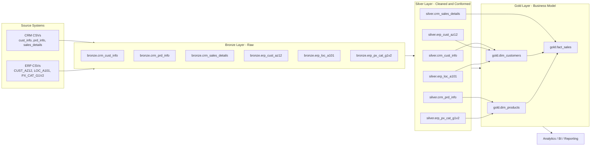

<h1 align="center">Data Warehouse (SQL Server)</h1>

<p align="center">
  Production-style Medallion Architecture for Analytics Engineering
</p>

<p align="center">
  <a href="https://www.microsoft.com/sql-server"></a>
  
  
  
</p>

<p align="center">
  
</p>

This repository demonstrates how to ingest raw CRM and ERP CSV data into SQL Server, transform and standardize it through Bronze and Silver layers, and publish analytics-ready Gold views for reporting.

## Quick Highlights

- End-to-end Medallion pipeline: Bronze -> Silver -> Gold
- Source systems: CRM and ERP CSV datasets
- Gold star-schema style outputs: dimensions + fact
- Quality validation scripts for Silver and Gold layers
- GitHub-friendly documentation and architecture visual

## Quick Navigation

| What You Want | Go To |
|---|---|
| See the full visual pipeline | [ETL Workflow Visual](#etl-workflow-visual) |
| Understand layer responsibilities | [Architecture](#architecture) |
| Run the full project quickly | [How to Run](#how-to-run) |
| Validate data quality | [Data Quality Checks](#data-quality-checks) |
| Review model and docs | [Documentation](#documentation) |

## Table of Contents

- [Project Overview](#project-overview)
- [Architecture](#architecture)
- [Repository Structure](#repository-structure)
- [Data Sources](#data-sources)
- [Tech Stack](#tech-stack)
- [How to Run](#how-to-run)
- [Data Model (Gold Layer)](#data-model-gold-layer)
- [Data Quality Checks](#data-quality-checks)
- [Key Transformations](#key-transformations)
- [Documentation](#documentation)
- [Troubleshooting](#troubleshooting)
- [Future Improvements](#future-improvements)

## Project Overview

The objective of this project is to build a clean and maintainable warehouse pipeline for analytics and reporting:

1. Bronze: load source data exactly as received.
2. Silver: clean, conform, and standardize data.
3. Gold: publish star-schema-style business views.

The project is designed for repeatable development execution (drop/recreate database, reload, validate).

## ETL Workflow Visual

This is the actual project workflow using your provided diagrams.

### 1) End-to-End Medallion Overview

<p align="center">
  
</p>

### 2) Source to Layer Lineage

<p align="center">
  
</p>

### 3) CRM and ERP Integration Mapping

<p align="center">
  
</p>

### 4) Gold Layer Model (Dimensions and Fact)

<p align="center">
  
</p>

### 5) ETL Methods Reference

<p align="center">
  
</p>

## Architecture

### Medallion Layers

- Bronze layer:
  - Raw ingestion from CSV files using BULK INSERT.
  - Minimal transformation.

- Silver layer:
  - Cleansing and standardization.
  - Type corrections.
  - Basic business rule enforcement.
  - Deduplication and conformance logic.

- Gold layer:
  - Business-friendly dimensional model.
  - Dimension views: customers and products.
  - Fact view: sales.

### High-Level Flow

Source CSVs -> Bronze Tables -> Silver Tables -> Gold Views -> BI / Analytics

### Architecture Diagram



## Repository Structure

```text
.
├── datasets/
│   ├── source_crm/
│   │   ├── cust_info.csv
│   │   ├── prd_info.csv
│   │   └── sales_details.csv
│   └── source_erp/
│       ├── CUST_AZ12.csv
│       ├── LOC_A101.csv
│       └── PX_CAT_G1V2.csv
├── docs/
│   ├── data_architecture.png
│   ├── data_flow.png
│   ├── data_integration.png
│   ├── data_model.png
│   ├── ETL.png
│   ├── data_layers.pdf
│   ├── Project_Notes_Sketches.pdf
│   ├── data_catalog.md
│   └── naming_conventions.md
├── scripts/
│   ├── init_database.sql
│   ├── bronze/
│   │   ├── ddl_bronze.sql
│   │   └── proc_load_bronze.sql
│   ├── silver/
│   │   ├── ddl_silver.sql
│   │   └── proc_load_silver.sql
│   └── gold/
│       └── ddl_gold.sql
└── tests/
    ├── quality_checks_silver.sql
    └── quality_checks_gold.sql
```

## Data Sources

Two upstream systems are used:

- CRM:
  - Customer info
  - Product info
  - Sales details

- ERP:
  - Customer demographics
  - Customer location
  - Product category metadata

## Tech Stack

- SQL Server (T-SQL)
- SQL Server BULK INSERT for ingestion
- SQL views for Gold semantic layer

Recommended tools:

- SQL Server Management Studio (SSMS), or
- Azure Data Studio

## How to Run

> Important: `scripts/init_database.sql` drops and recreates the full `DataWarehouse` database.

### 1) Create Database and Schemas

Run:

- `scripts/init_database.sql`

This creates:

- `bronze` schema
- `silver` schema
- `gold` schema

### 2) Create Bronze/Silver Structures and Gold Views

Run in this order:

1. `scripts/bronze/ddl_bronze.sql`
2. `scripts/silver/ddl_silver.sql`
3. `scripts/gold/ddl_gold.sql`

### 3) Load Data into Bronze

Run:

- `scripts/bronze/proc_load_bronze.sql`
- `EXEC bronze.load_bronze;`

### 4) Transform and Load into Silver

Run:

- `scripts/silver/proc_load_silver.sql`
- `EXEC silver.load_silver;`

### 5) Validate with Quality Checks

Run:

1. `tests/quality_checks_silver.sql`
2. `tests/quality_checks_gold.sql`

### Suggested Full Execution Order

1. `scripts/init_database.sql`
2. `scripts/bronze/ddl_bronze.sql`
3. `scripts/silver/ddl_silver.sql`
4. `scripts/gold/ddl_gold.sql`
5. `scripts/bronze/proc_load_bronze.sql`
6. `EXEC bronze.load_bronze;`
7. `scripts/silver/proc_load_silver.sql`
8. `EXEC silver.load_silver;`
9. `tests/quality_checks_silver.sql`
10. `tests/quality_checks_gold.sql`

## Data Model (Gold Layer)

The Gold layer exposes analytical views:

- `gold.dim_customers`
  - Customer master data enriched with ERP demographics and location.

- `gold.dim_products`
  - Product master data with category/subcategory/maintenance metadata.
  - Filters to current records (active products).

- `gold.fact_sales`
  - Transaction-level sales linked to product and customer dimensions.

For detailed column descriptions, see:

- [docs/data_catalog.md](docs/data_catalog.md)

## Data Quality Checks

Quality checks include:

- Null/duplicate key detection
- Standardization checks (trimmed strings, normalized values)
- Date validity and date-order checks
- Sales consistency checks (`sales = quantity * price`)
- Gold layer referential integrity checks

Check scripts:

- [tests/quality_checks_silver.sql](tests/quality_checks_silver.sql)
- [tests/quality_checks_gold.sql](tests/quality_checks_gold.sql)

## Key Transformations

Examples implemented in Silver:

- Customer deduplication using latest `cst_create_date`
- Gender normalization (`F/M/Female/Male` -> `Female/Male`)
- Marital status normalization (`S/M` -> `Single/Married`)
- Country code normalization (`DE`, `US`, `USA`, null handling)
- Product category parsing from product key
- Product lifecycle handling via lead-based end date derivation
- Invalid/future date handling
- Sales and price correction logic for invalid/zero values

## Documentation

- Naming conventions: [docs/naming_conventions.md](docs/naming_conventions.md)
- Gold data catalog: [docs/data_catalog.md](docs/data_catalog.md)

## Troubleshooting

### BULK INSERT file path errors

The Bronze load procedure currently uses absolute file paths. If load fails:

1. Ensure SQL Server service account has file read access.
2. Update paths in `scripts/bronze/proc_load_bronze.sql` to match your local machine.
3. Verify exact file names and case for ERP CSV files.

### Permission issues

Make sure your SQL login has permission to:

- Create/drop database
- Create schema, tables, views, procedures
- Execute BULK INSERT

### Data mismatches in quality checks

When checks return rows:

1. Inspect affected source records in Bronze.
2. Validate transformation rules in Silver procedure.
3. Re-run load sequence after changes.
